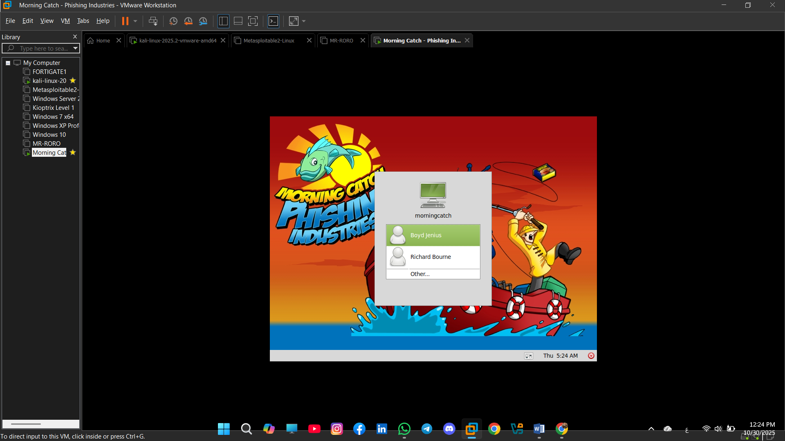
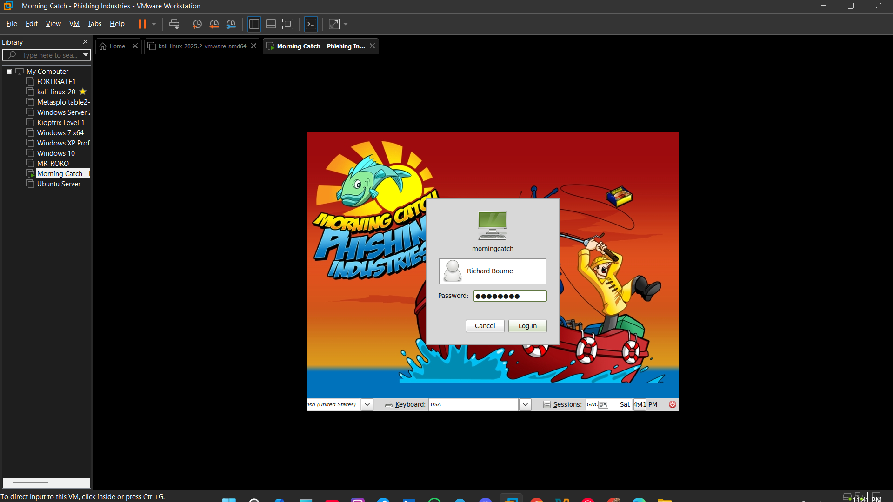
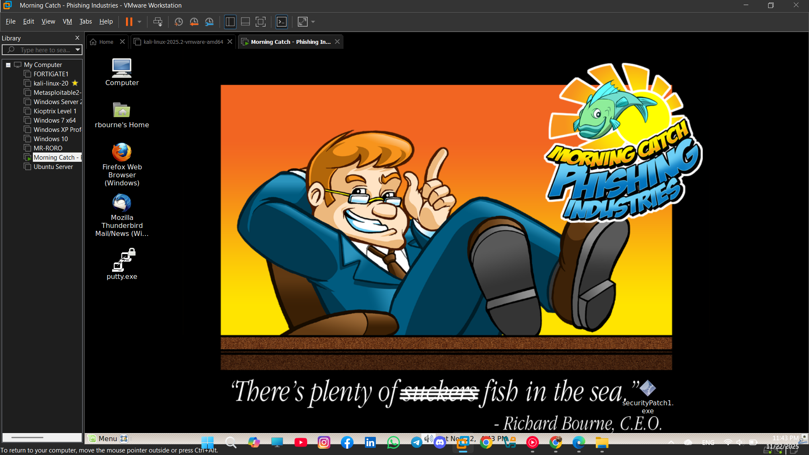

# Advanced Social Engineering Campaign

### Controlled Social Engineering & Phishing Awareness Project

A cybersecurity project demonstrating a controlled social engineering campaign in an authorized educational environment.

The project focuses on understanding social engineering techniques, campaign workflow, phishing awareness, and documenting the results of a controlled security exercise.

---

## Project Overview

This project demonstrates a structured social engineering campaign designed for cybersecurity education and awareness purposes.

The project includes:

- Controlled phishing campaign demonstration
- Social engineering methodology
- Campaign workflow documentation
- Practical lab demonstration
- Evidence and screenshots
- Detailed technical report
- Project presentation

---

## Objectives

- Demonstrate the principles of social engineering attacks.
- Understand the workflow of a controlled phishing campaign.
- Analyze the different stages of a social engineering exercise.
- Document the methodology and observations.
- Improve cybersecurity awareness and defensive understanding.

---

## Project Contents

### Demo

A recorded demonstration of the project workflow.

The video is excluded from the Git repository because of its large file size.

### Presentation

The project presentation provides an overview of:

- Project objectives
- Social engineering concepts
- Campaign methodology
- Practical demonstration
- Results and observations

### Report

The complete project report documents the campaign, methodology, practical work, observations, and results in detail.

### Screenshots

The `SCREENSHOTS` directory contains visual evidence documenting different stages of the project and the practical demonstration.

### Campaign Setup



### Practical Demonstration



### Lab Environment



---

## Campaign Workflow

The project follows a structured workflow covering:

1. Planning
2. Reconnaissance
3. Social Engineering
4. Campaign Execution
5. Observation & Analysis
6. Documentation
7. Security Awareness

---

## Tools & Environment

The project was conducted in a controlled cybersecurity laboratory environment using virtualized systems and security testing tools.

The practical environment includes:

- Kali Linux
- VMware Workstation
- Isolated Virtual Machines
- Phishing / Social Engineering Lab Environment

---

## Security & Ethics

This project was conducted strictly for educational and authorized cybersecurity purposes.

No unauthorized systems, accounts, or real-world targets were intentionally involved.

The repository is intended for:

- Cybersecurity education
- Security awareness
- Academic demonstration
- Authorized security testing

---

## Project Structure

```text
advanced-social-engineering-campaign/
│
├── PRESENTATION/
│   └── Final_Project_Presentation.pdf
│
├── REPORT/
│   └── FINAL-PROJECT-REPORT.pdf
│
├── SCREENSHOTS/
│   ├── 1.png
│   ├── 2.png
│   ├── 3.png
│   ├── ...
│   └── 36.jpg
│
├── .gitignore
└── README.md